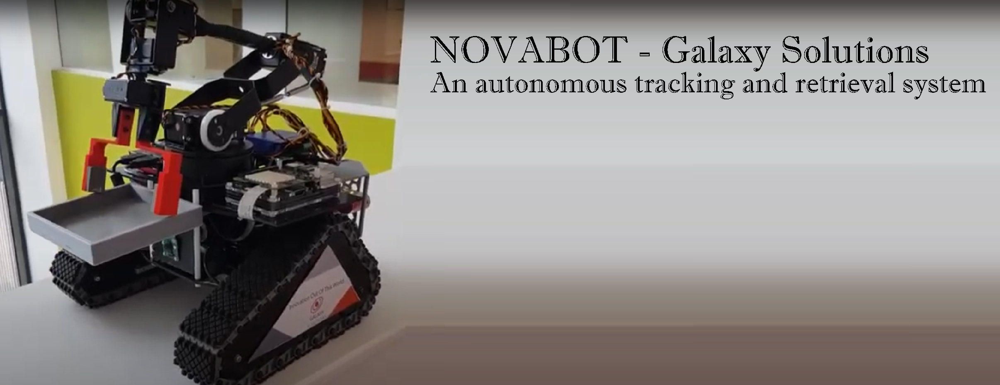

# Galaxy-Solutions-NovaBot

3rd year robotics project  

A record of my 3rd year group project to create an automonous system capable of tracking 'rogue' droids by:
- identifing an error signal amongst multiple droids; and then
- immobilising safely and returning any rogue droid to a designated 'maintenance' area.

My specific contribution to this was with regards to the overhead live tracking of multiple droids, followed by the detection of their error codes via the use of OpenCV and Tensorflow which I have shown below. An overview of our entire project can be found on the group youtube channel [here](https://www.youtube.com/@galaxysolutions9446/featured).

- [Puck Detection and tracking 1](https://www.youtube.com/watch?v=BW3P7t9nB7w)
- [Puck Detection and tracking 2](https://www.youtube.com/watch?v=5fYSBhuBZVU)
- [Rogue error code detection](https://www.youtube.com/watch?v=81y13W2RRVI)

